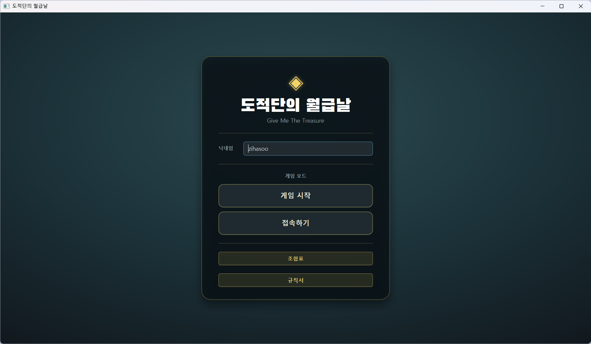
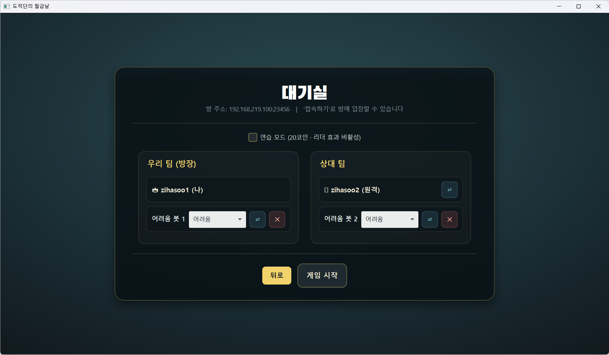
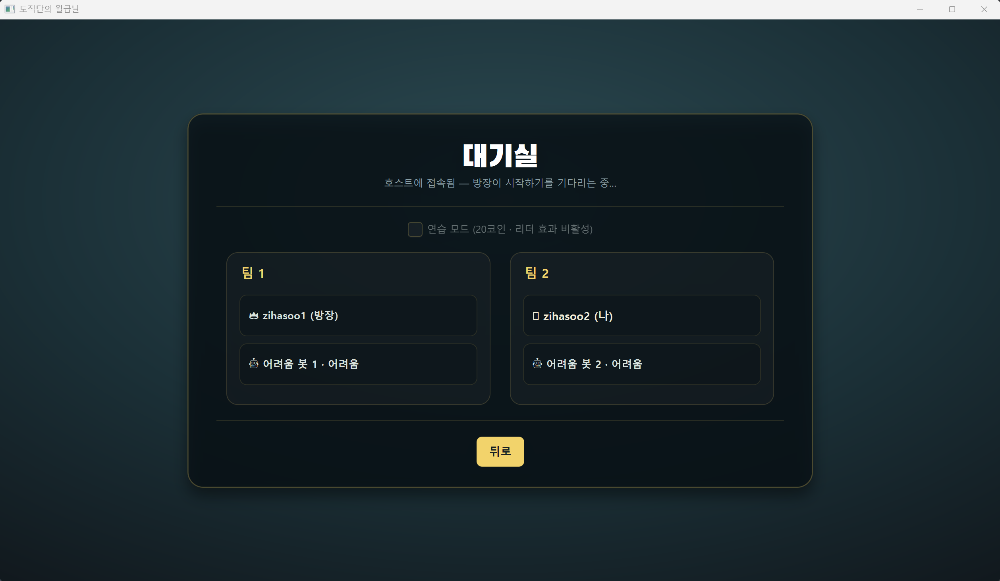
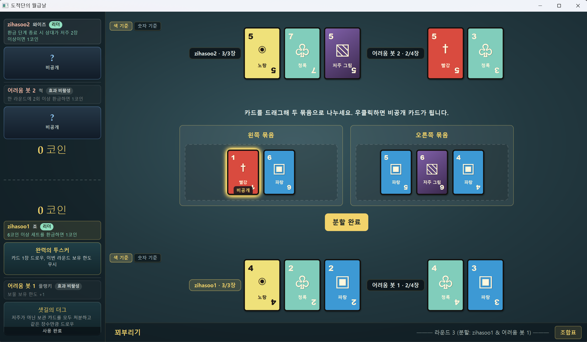
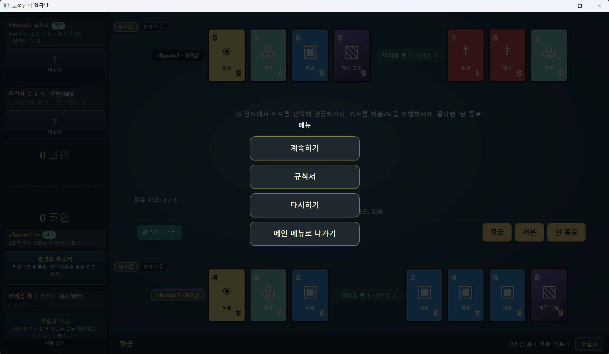
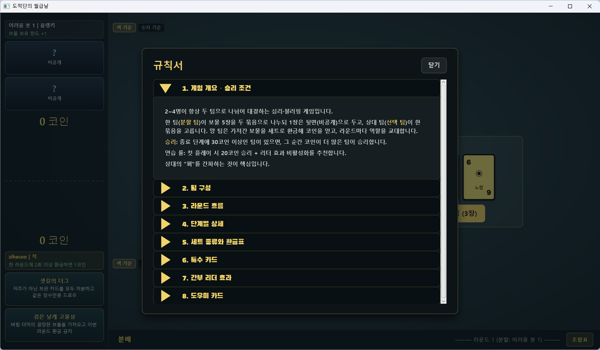
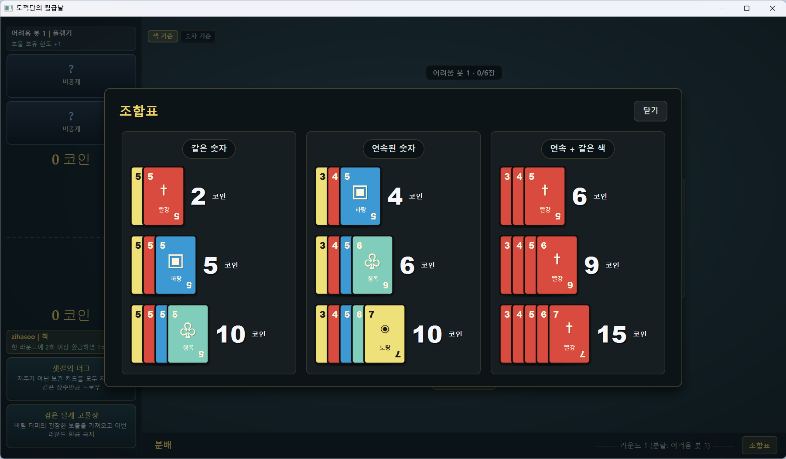
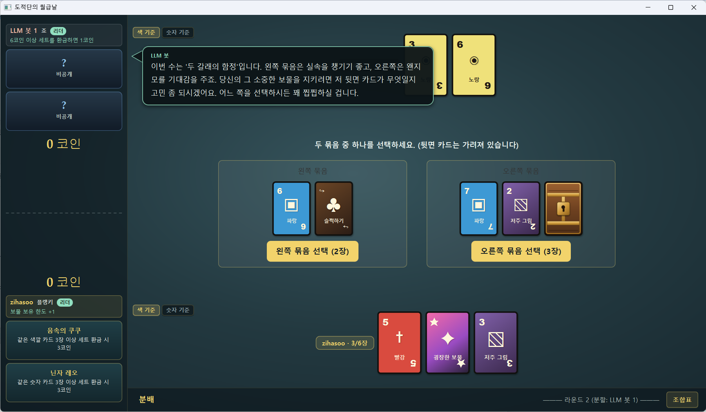

# 도적단의 월급날

`give-me-the-treasure`는 보드게임 **도적단의 월급날**을 JavaFX로 구현한 데스크톱 게임입니다. 한 팀이 보물 5장을 두 묶음으로 나누고, 상대 팀이 그중 한 묶음을 고르는 블러핑 게임입니다. 좋은 보물을 숨기는 쪽과 그 꾀를 읽는 쪽이 매 라운드 역할을 바꾸며 겨루는 구조입니다.

이 프로젝트는 로컬 플레이, 봇 대전, LAN 네트워크 플레이, 인게임 규칙서, 환금 조합표, 플레이 로그, 봇 전략 실험까지 포함하고 있습니다.

## 실행 화면

메인 메뉴에서 닉네임을 입력합니다. 게임 시작을 누르면 로컬/원격 슬롯을 함께 구성할 수 있는 통합 대기실을 만들고, 접속하기를 누르면 IP 입력창을 통해 다른 사용자의 대기실에 진입할 수 있습니다.



대기실에서 팀 구성, 봇 난이도, 원격 플레이어 슬롯, 연습 모드를 설정할 수 있습니다.



원격 참가자는 호스트에 접속한 뒤 방장이 게임을 시작할 때까지 대기실 상태를 확인합니다.



게임 화면에서는 팀별 보관 카드와 코인, 간부 카드, 도우미를 볼 수 있고, 화면 가운데에서 카드 분할, 선택 등을 진행합니다.



일시정지 메뉴에서는 규칙서를 볼 수 있고, 게임을 재시작(방장만 가능)하거나 메인 메뉴로 나갈 수 있습니다.



인게임에서도 규칙서와 조합표를 바로 확인해 현재 상황에 맞는 규칙과 환금 조합을 빠르게 찾아볼 수 있습니다.

<p>
  
  
</p>

LLM 봇을 사용하면 어려움 봇의 조언 + LLM의 생각대로 게임을 진행하고, 상황에 맞춘 대사가 말풍선으로 표시됩니다. (LLM봇은 1대1만 지원합니다.)



## 실행 방법

필요한 환경은 Java 25와 Gradle Wrapper입니다. 저장소에는 Gradle Wrapper가 포함되어 있으므로 별도 Gradle 설치 없이 실행할 수 있습니다.

```powershell
.\gradlew.bat run
```

테스트는 다음처럼 실행합니다.

```powershell
.\gradlew.bat test
```

느린 통합 테스트까지 확인하려면 다음 명령을 사용합니다.

```powershell
.\gradlew.bat integrationTest
```

봇 대전 표본 수를 늘려 회귀 신호를 보고 싶을 때는 `botSeedCount`를 지정합니다.

```powershell
.\gradlew.bat -DbotSeedCount=300 integrationTest
```

플레이 진행 로그가 필요하면 `payday.playlog`를 켭니다. 로그는 `logs/play-*.log`에 기록됩니다.

```powershell
.\gradlew.bat -Dpayday.playlog=true run
```

봇 후보 점수 로그가 필요하면 `bot.debugScores`를 켭니다. 로그는 `logs/bot-scores.log`에 기록됩니다.

```powershell
.\gradlew.bat -Dbot.debugScores=true integrationTest
```

LLM 봇을 사용할 때 입력한 Gemini API 키는 실행 폴더의 `gemini-api-key.txt`에 저장됩니다. 이 파일은 `.gitignore`에 포함되어 커밋되지 않습니다.

## 주요 기능

- **2~4인 팀 대전**을 지원합니다. 1 vs 1, 1 vs 2, 2 vs 2 구성이 가능합니다.
- **로컬 플레이**를 지원합니다. 한 PC에서 사람과 봇을 섞어 게임을 시작할 수 있습니다.
- **LAN 네트워크 플레이**를 지원합니다. 한 사용자가 호스트가 되고, 다른 사용자는 클라이언트로 접속합니다.
- **난이도별 봇**을 제공합니다. 쉬움, 중간, 어려움 봇은 같은 S8 기반 전략을 공유하되 정보량과 판단 정밀도를 다르게 사용합니다.
- **LLM 봇**을 제공합니다. Gemini API 키가 있으면 LLM이 분할/선택 대사를 만들고, 합법성은 내장 S8 전략으로 보호합니다.
- **인게임 규칙서와 조합표**를 제공합니다. 처음 플레이하는 사람도 게임 중 ESC 메뉴나 화면 버튼으로 규칙을 확인할 수 있습니다.
- **연습 모드**를 제공합니다. 연습 모드는 20코인 승리, 간부 효과 비활성 규칙입니다.
- **플레이 로그와 봇 검증 테스트**를 제공합니다. 사람 vs 봇 로그 분석과 헤드리스 봇 대전 테스트로 전략 회귀를 확인합니다.

## 게임 흐름

한 라운드는 네 단계로 진행됩니다.

1. **꾀부리기**: 분할 팀 리더가 보물 5장을 뽑아 두 묶음으로 나눕니다. 정확히 1장은 뒷면으로 둡니다.
2. **분배**: 선택 팀이 한 묶음을 고릅니다. 선택한 묶음은 선택 팀이, 나머지는 분할 팀이 가져갑니다.
3. **환금**: 각 플레이어가 자기 보관 카드로 세트를 만들고 코인을 얻거나, 카드를 처분하거나, 도우미를 사용합니다.
4. **종료**: 승리 코인 도달 여부와 보유 한도를 확인합니다. 승자가 없으면 역할을 바꾸고 다음 라운드를 시작합니다.

자세한 규칙은 [도적단의 월급날 규칙서](docs/도적단의_월급날_규칙.md)에 정리되어 있습니다.

## 프로젝트 구조

핵심 구조는 `Game`이 규칙 상태 머신을 맡고, `Player` 계층이 사람, 봇, 원격 플레이어를 같은 인터페이스로 감싸는 방식입니다. JavaFX 화면은 `GameListener` 이벤트를 받아 렌더링하고, 사용자 입력은 `InputGateway`를 통해 다시 플레이어 결정으로 전달됩니다.

```text
GameApp
  -> GameBoardController
      -> Game(game-loop thread)
          -> Player(decideSplit / decideChoice / beginCashIn)
              -> HumanPlayer / BotPlayer / NetworkPlayer
      <- GameListener events
      -> JavaFX render updates
```

게임 루프와 UI 렌더링은 서로 다른 스레드에서 동작합니다. `Game.play()`는 `game-loop` 스레드에서 규칙을 순서대로 진행하고, JavaFX 화면 변경은 `Platform.runLater`로 UI 스레드에 넘깁니다. 사람의 선택은 `SynchronousQueue`와 환금용 제출 큐를 통해 게임 루프에 전달됩니다. 이 구조 덕분에 같은 `Player` 계약 위에 로컬 사람, 봇, 원격 클라이언트를 모두 붙일 수 있습니다.

자세한 구조와 확장 지점은 [프로그램 구조 문서](docs/ARCHITECTURE.md)에 정리되어 있습니다.

## 봇 전략

현재 기본 봇은 **S8**입니다. 초기 봇은 지금 당장 얻는 세트 코인만 보았지만, 이후 세대는 블러핑 분할, 환금 보류, 상대 보관 카드 견제, 저주 부채, 와일드 확보, 종반 마진 판단을 차례로 더했습니다. S8은 여기에 공개 정보 카드 카운팅, 상대 선택 확률 모델, 실제 환금 결과 기반 종반 평가, 2v2 팀 분배, 도우미 드래프트 상황화를 얹은 버전입니다.

봇 발전 과정은 크게 다음 흐름입니다.

| 단계 | 핵심 변화 |
|---|---|
| Heuristic~S3 | 세트 가치와 간단한 상황 점수로 분할/선택을 판단했습니다. |
| S4~S6 | 환금 보류, 상대 카드 견제, 현실적인 선택자 예측, 플레이 로그 분석을 도입했습니다. |
| S7 | 사람 상대 로그에서 드러난 와일드 헌납, 저주 처리, 종반 판단 문제를 고쳤습니다. |
| S8 | 카드 카운팅, 상대 확률 모델, 실현 코인 평가, 2v2 팀 분배, 도우미 상황화를 추가했습니다. |

쉬움/중간/어려움 봇은 S8을 기반으로 하되 보이는 정보와 단순 판단 비율을 조절해 난이도를 나눕니다.

## LLM 봇

LLM 봇은 Gemini를 사용해 사람과 1:1로 겨루는 말하는 봇입니다. 목적은 최강 봇이라기보다, 분할과 선택 과정에서 근거 있는 한마디와 블러핑을 던지는 상대를 만드는 것입니다.

- 대기실에서 `LLM` 봇을 선택할 수 있습니다.
- LLM 봇은 현재 **로컬 1:1**에서만 지원됩니다. 원격 플레이어나 다인 팀이 섞인 구성에서는 시작 시 안내가 표시됩니다.
- Gemini API 키가 필요하면 시작 시 입력받고, 입력한 키는 `gemini-api-key.txt`에 저장됩니다.
- 분할과 선택은 LLM이 `{대사, 결정}`을 만들지만, 내장 S8 조언을 함께 받아 합법성을 보호합니다.
- LLM 응답이 불법이거나 호출에 실패하면 조용히 S8 결정으로 폴백합니다.
- 도우미 선택, 환금, 팀 분배처럼 합법성 부담이 큰 결정은 S8에 맡깁니다. 대신 실제 환금이나 게임 종료에서는 LLM이 반응 대사를 만들 수 있습니다.

봇이 발전해 온 과정, 시행착오, 테스트 결과, 남은 로드맵은 [봇 전략 현황과 로드맵](docs/BOT_STRATEGY_PLAN.md)에 정리되어 있습니다.

## 참고 문서

- [규칙서](docs/도적단의_월급날_규칙.md)
- [프로그램 구조](docs/ARCHITECTURE.md)
- [봇 전략 현황과 로드맵](docs/BOT_STRATEGY_PLAN.md)
